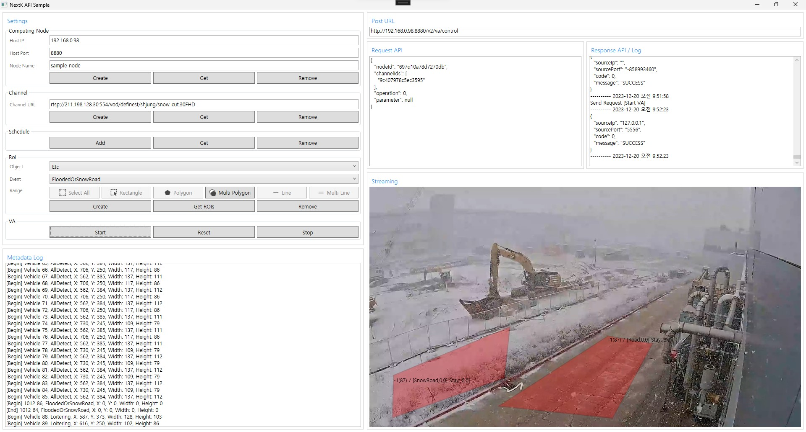

# **nkai-sample-codes README**
NK에서 제공하는 서비스 사용을 위한 예제 샘플 코드

# **NKClientQuickSample QuickStarts**
## **사전 준비**
* .NET SDK 7.0
  - https://dotnet.microsoft.com/ko-kr/download/dotnet/7.0
* Visual Studio 2022 설치
  - https://visualstudio.microsoft.com/ko/vs/
* NKEdge v1.1.0
* ffmpeg5 dll 설치
  - 솔루션 경로/NKAPISample 폴더에 dlls 폴더 생성
  - 생성한 dlls 폴더에 ffmpeg 폴더 생성
  - 생성된 [솔루션 경로/NKAPISample/dlls/ffmpeg] 폴더에 ffmpeg5 dll 붙여넣기
	- avcodec-59.dll
	- avformat-59.dll
	- avutil-57.dll
	- swresample-4.dll
	- swscale-6.dll
* NKAPISample 솔루션 빌드

### **API Request/Response**
## **NK API**
https://nextk-developer.github.io/nkapi/

## **Sample UI 사용시**
1. ComptuteNode 하위 정보 입력
2. Channel RTSP URL 입력
3. Select API 포맷 이용 (아래 순서로 요청)
	- **[Computing Node]** - [Create] 버튼 클릭하여 노드 생성
	- **[Channel]** - [Create] 버튼 클릭하여 채널 생성
	- **[Schedule]** - [Add] 버튼 클릭하여 매일 1시간마다 분석 스케줄 지정(기본값)
	- **[RoI]** - [Object] 분석 대상 선택 - [Event] 분석 이벤트 선택 - [Range] 영역 타입 클릭 - 우측 [Streaming] 에서 화면 클릭하여 영역 지정
		- [Select All] : 전체 영역
		- [Rectangle] : 사각 영역
			- [Streaming] 화면에서 두 점을 클릭하여 사각 영역 지정
		- [Polygon] : 다각 영역
			- [Streaming] 화면에서 n개의 점을 클릭하여 다각 영역 지정
		- [Multi Polygon] : 다중 다각 영역
			- [Streaming] 화면에서 n개의 점을 클릭하여 다각 영역을 지정하고, **마우스 우클릭**으로 하나의 다각형을 완성. 다각형 여러개를 그린 후 **더블클릭하면 영역 지정 완료**.
			- 현재 버전에서는 **침수/적설(Etc Object - FloodedOrSnowRoad Event)**에서만 적용 가능
		- [Line] : 선 영역
			- [Streaming] 화면에서 두 점을 클릭하여 하나의 선 영역 지정
		- [Multi Line] : 다중 선 영역
			- [Streaming] 화면에서 두 점씩 n번 클릭하여 다중 선 영역 지정
		- 영역 지정 후 [Create] 버튼 클릭하여 지정된 영역을 Roi 영역으로 등록
	- **[VA]** -[Start] 버튼 클릭하여 분석 시작

## **분석 결과 확인**
영상 내 이벤트 발생시 결과 영상 Annotation 및 Text 출력

